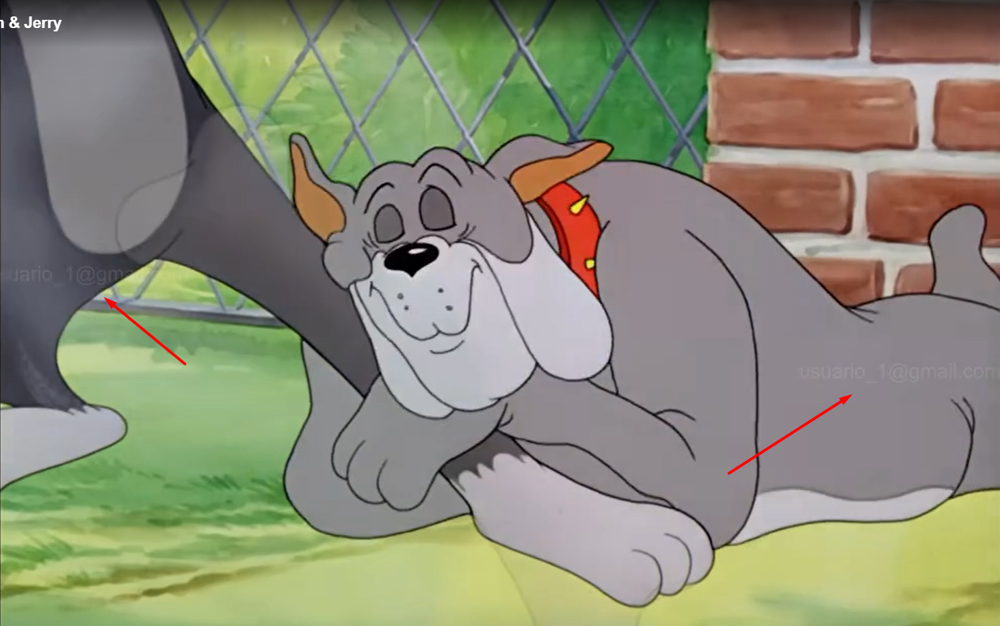

<h1 align="center">Sistema de Proteção contra Redistribuição de Conteúdo de Streaming</h1>

    

<h2>Descrição</h2>

    Este projeto é um protótipo de plataforma de streaming com foco na proteção de conteúdos particulares contra redistribuição não autorizada. A solução foi desenvolvida para garantir que o usuário que compartilha conteúdo de forma indevida seja facilmente identificado e possa ser processado, além de ter sua conta na plataforma banida rapidamente.

    A plataforma utiliza marcas d'água dinâmicas e personalizadas, inseridas diretamente nos vídeos durante a transmissão, para identificar de maneira única cada usuário que está assistindo. As marcas d'água são posicionadas de forma aleatória e em intervalos variáveis para dificultar a remoção, ajudando na identificação de usuários que compartilham o conteúdo indevidamente.

<h2>Benefícios da Solução</h2>

<ul>
    <li><strong>Anti-redistribuição:</strong> Protege o conteúdo contra redistribuição não autorizada, permitindo que cada sessão de vídeo seja marcada de forma única com informações que identificam o usuário que está assistindo.</li>
    <li><strong>Identificação de Usuário:</strong> A inserção de marcas d'água personalizadas permite identificar rapidamente o usuário que redistribuiu o conteúdo, facilitando processos legais contra a pirataria e permitindo o banimento do infrator da plataforma.</li>
    <li><strong>Processamento de Infrações:</strong> Com a identificação rápida do usuário infrator, a plataforma permite ações imediatas, como o banimento da conta e possíveis processos legais, protegendo os direitos autorais e os interesses das empresas que distribuem o conteúdo.</li>
</ul>

<h2>Contexto</h2>

    Este protótipo foi desenvolvido como uma resposta direta ao que consideramos um abuso de entidades como a Anatel, que propôs um orçamento de apenas R$7.000,00 para o desenvolvimento de soluções que protegem bilhões de reais em conteúdo digital.

<h2>Personalização e Alterações</h2>

    Este projeto é totalmente modular e permite a fácil implementação de novas funcionalidades para aumentar a segurança do conteúdo, incluindo:

<ul>
    <li><strong>Detecção de tonalidades do vídeo:</strong> Implementação de marcas d'água com cores e fontes que se adaptam ao conteúdo exibido, tornando a identificação menos perceptível para o usuário e mais difícil de remover.</li>
    <li><strong>Adaptação de Marcas d'água:</strong> Alterações no posicionamento, opacidade, e estilo da fonte das marcas d'água para maximizar o impacto na experiência do usuário infrator, sem interferir na experiência do espectador honesto.</li>
    <li><strong>Código Aberto a Mudanças:</strong> Contribuições e sugestões de melhorias são bem-vindas, tornando a solução mais robusta e adequada para diversos cenários de uso.</li>
</ul>

<h2>Como Executar o Projeto</h2>

<h3>Pré-requisitos</h3>

<ul>
    <li>Node.js instalado na máquina.</li>
    <li>FFmpeg instalado e configurado corretamente no diretório indicado.</li>
    <li>As bibliotecas necessárias instaladas via <code>npm</code>.</li>
</ul>

<h3>Instalação</h3>

<ol>
    <li>Clone o repositório e instale as dependências:</li>
</ol>

npm install

Certifique-se de que os binários do FFmpeg estão configurados corretamente nos caminhos indicados no código:

ffmpeg.setFfmpegPath('./libs/ffmpeg/bin/ffmpeg.exe');
 
ffmpeg.setFfprobePath('./libs/ffmpeg/bin/ffprobe.exe');

<ol start="2"> <li>Execute o servidor:</li> </ol>

node server-stream.js

Acesse no navegador: <a href="http://localhost:3000">http://localhost:3000</a>
 <h3>Uso</h3> <ul> <li>Faça login com um email válido.</li> <li>Explore os conteúdos disponíveis e assista aos vídeos.</li> <li>Cada vídeo será exibido com marcas d'água personalizadas para o usuário logado, garantindo a proteção contra redistribuição.</li> </ul> 

<h2>Considerações Finais</h2> 
 Este projeto é uma solução de código aberto e está disponível para modificações e aprimoramentos. Ele serve como um protótipo robusto para demonstrar que é possível combater a redistribuição não autorizada de conteúdo digital de forma eficaz, segura e adaptável. 
